# Stripe Subscription Flow Documentation

**Last Updated**: October 25, 2025
**Status**: Production-Ready
**Development Setup**: Uses Stripe CLI for webhook forwarding (see [STRIPE_CLI_SETUP.md](STRIPE_CLI_SETUP.md))

## Table of Contents
1. [Sequence Diagrams](#sequence-diagrams)
2. [Webhook Flow (Development & Production)](#webhook-flow-development--production)
3. [Production Readiness Analysis](#production-readiness-analysis)
4. [Potential Issues & Mitigations](#potential-issues--mitigations)

---

## Sequence Diagrams

### 1. Subscription Creation Flow (Happy Path)


### 2. Monthly Billing Cycle (Recurring Payment)


### 3. Subscription Cancellation Flow


### 4. Subscription Update Flow (Upgrade/Downgrade)

```mermaid
sequenceDiagram
    participant User
    participant NextJS as Next.js Frontend
    participant NestJS as NestJS API
    participant Firebase
    participant Stripe

    User->>NextJS: Change plan (Pro → Business)
    NextJS->>NestJS: POST /stripe/update-subscription<br/>{newTier: 'business'}

    NestJS->>Firebase: Get stripeSubscriptionId
    Firebase-->>NestJS: Subscription ID

    NestJS->>NestJS: Get new price ID for tier

    NestJS->>Stripe: Update subscription items<br/>(proration_behavior: 'always_invoice')
    Stripe-->>NestJS: Updated subscription

    NestJS-->>NextJS: {success, subscription}

    Note over Stripe: Subscription updated<br/>Prorated invoice created

    Stripe->>NestJS: POST /stripe/webhook<br/>customer.subscription.updated
    Note over NestJS: Verify signature

    NestJS->>Firebase: Find user from subscription metadata
    Firebase-->>NestJS: User data

    NestJS->>Firebase: Update subscription details:<br/>- subscriptionStatus<br/>- currentPeriodStart<br/>- currentPeriodEnd<br/>- cancelAtPeriodEnd
    Firebase-->>NestJS: Success

    NestJS-->>Stripe: 200 OK

    NextJS->>User: Show updated plan & usage limits
```



---

## Webhook Flow (Development & Production)

### How Webhooks Work

**Both development and production use the same webhook-based flow:**
- **Production**: Stripe sends webhooks directly to your public HTTPS endpoint
- **Development**: Stripe CLI forwards webhooks from Stripe to your localhost

See [STRIPE_CLI_SETUP.md](STRIPE_CLI_SETUP.md) for detailed setup instructions.

---

### Webhook Flow

**How It Works:**
1. Stripe event occurs (checkout completed, payment succeeded, etc.)
2. Stripe sends webhook to your endpoint (`/stripe/webhook`)
3. NestJS verifies the webhook signature using `STRIPE_WEBHOOK_SECRET`
4. Processes the event and updates Firebase
5. Returns `200 OK` to Stripe to acknowledge receipt

**Webhook Events Handled:**
- `checkout.session.completed` - Initial subscription creation (resets usage)
- `invoice.payment_succeeded` - Monthly billing (resets usage quota)
- `invoice.payment_failed` - Failed payments (logged for monitoring)
- `customer.subscription.updated` - Plan changes, billing updates
- `customer.subscription.deleted` - Cancellations (downgrades to free)

---

### Development Setup with Stripe CLI

**Terminal 1: Start Your Services**
```bash
npm run dev:all  # Redis + API + Frontend
```

**Terminal 2: Forward Webhooks**
```bash
stripe listen --forward-to localhost:3001/stripe/webhook
```

**What Happens:**
```
Stripe.com → Stripe CLI (on your laptop) → POST localhost:3001/stripe/webhook → Your API
```

The Stripe CLI acts as a proxy, forwarding webhook events from Stripe's servers to your local machine.

**Output:**
```
> Ready! Your webhook signing secret is whsec_xxx...
> Listening for webhook events

2025-10-25 15:30:12   --> checkout.session.completed [evt_xxx]
2025-10-25 15:30:12   <--  [200] POST http://localhost:3001/stripe/webhook
```

---

### Production Setup

**1. Register Webhook in Stripe Dashboard**
- URL: `https://api.neuralsummary.com/stripe/webhook`
- Events: Same 5 events as above
- Get signing secret: `whsec_prod_xxx`

**2. Set Environment Variable**
```bash
STRIPE_WEBHOOK_SECRET=whsec_prod_xxx
```

**3. Test**
Use Stripe Dashboard → Webhooks → Send test webhook

---

### Advantages of Webhook-Only Approach

✅ **Identical dev/prod flow** - No separate code paths
✅ **Automatic** - No frontend involvement needed
✅ **Reliable** - Stripe retries failed webhooks automatically
✅ **Real-time** - Updates happen immediately when events occur
✅ **Secure** - Signature verification prevents tampering
✅ **Complete** - Handles all lifecycle events (billing, failures, cancellations)
✅ **Easy testing** - Use `stripe trigger checkout.session.completed` to test

---

### Requirements

**Development:**
- Stripe CLI installed (`brew install stripe/stripe-cli/stripe`)
- Running `stripe listen --forward-to localhost:3001/stripe/webhook`
- `STRIPE_WEBHOOK_SECRET` from CLI in `.env`

**Production:**
- Public HTTPS endpoint accessible by Stripe
- Webhook registered in Stripe Dashboard
- `STRIPE_WEBHOOK_SECRET` from Dashboard in environment variables

---

## Production Readiness Analysis

### ✅ What's Working Well

#### 1. **Webhook Security**
- Signature verification using `STRIPE_WEBHOOK_SECRET`
- Raw body preservation for signature validation
- Proper error handling and logging

#### 2. **Data Consistency**
- Firebase updates are atomic (single `updateUser` call)
- Metadata includes `userId` and `tier` for reliable lookups
- Customer ID saved for future webhook lookups

#### 3. **User Experience**
- Usage resets on subscription upgrade (via webhook)
- Clear date format (dd-MMM-yyyy)
- Subscription tier updates via webhook within 1-2 seconds

#### 4. **Error Handling**
- Proper try-catch blocks
- Detailed logging for debugging
- Graceful degradation when users/subscriptions not found

#### 5. **Flexible Payment Options**
- Supports both subscription and PAYG (pay-as-you-go)
- Multiple billing cycles (monthly/annual)
- Multiple tiers (professional/business)

---

## Potential Issues & Mitigations

### 🔴 CRITICAL Issues

#### 1. **Race Condition: Webhook vs User Redirect**

**Problem:**
User might land on success page BEFORE webhook completes:

```
T+0s: User completes payment at Stripe
T+1s: Stripe redirects user to /checkout/success
T+2s: User sees "No subscription" (webhook hasn't arrived yet)
T+3s: Webhook arrives and updates Firebase
T+4s: User refreshes and sees subscription
```

**Impact:** User confusion, appears like subscription didn't work

**Mitigation Options:**

**Option A: Polling (Recommended)**
```typescript
// In checkout success page
useEffect(() => {
  const pollSubscription = async () => {
    for (let i = 0; i < 10; i++) {
      const response = await fetch('/stripe/subscription');
      if (response.subscriptionTier !== 'free') {
        // Subscription synced!
        break;
      }
      await sleep(2000); // Wait 2 seconds
    }
  };

  pollSubscription();
}, []);
```

**Option B: WebSocket Notification**
- Backend emits WebSocket event when webhook completes
- Frontend listens for subscription update events
- Immediately shows success when received

**Option C: Session Status Check**
```typescript
// Check session payment_status directly
const session = await stripe.checkout.sessions.retrieve(sessionId);
if (session.payment_status === 'paid') {
  // Show success, even if webhook pending
}
```

**Current Status:** ⚠️ Not implemented - May cause user confusion

---

#### 2. **Missing Webhook Retry Logic**

**Problem:**
If webhook handler crashes or Firebase is down, webhook fails with 500 error. Stripe will retry, but:
- No idempotency checks
- Could cause duplicate updates (though updateUser is idempotent in practice)
- No tracking of failed webhooks

**Impact:** Low (Stripe retries automatically), but could cause issues if handler has side effects

**Mitigation:**
```typescript
// Add idempotency key tracking
const processedWebhooks = new Set<string>();

async handleWebhook(event: Stripe.Event) {
  if (processedWebhooks.has(event.id)) {
    return { received: true }; // Already processed
  }

  // Process webhook...

  processedWebhooks.add(event.id);
  // Or store in Firebase/Redis for persistence
}
```

**Current Status:** ⚠️ Not implemented - Relies on Stripe retries (acceptable risk)

---

### 🟡 MODERATE Issues

#### 3. **No Email Notifications**

**Problem:**
Users don't receive email notifications for:
- Subscription confirmation
- Payment failures
- Subscription cancellations
- Usage quota warnings

**Impact:** Medium - Users might miss important events

**Mitigation:**
- Implement email service (already exists: `EmailService` for sharing transcripts)
- Send emails in webhook handlers
- Use Stripe's built-in email notifications as backup

**Current Status:** ⚠️ Not implemented - But Stripe sends basic emails

---

#### 5. **No Webhook Failure Monitoring**

**Problem:**
If webhooks fail repeatedly, no alerting system exists. Could lead to:
- Paid users stuck on free tier
- Usage quotas not resetting
- Subscription status out of sync

**Impact:** Medium - Silent failures

**Mitigation:**
- Monitor Stripe webhook dashboard regularly
- Set up error alerting (e.g., Sentry, Datadog)
- Create admin dashboard to view webhook failures
- Implement health check endpoint

**Current Status:** ⚠️ Not implemented - Manual monitoring needed

---

#### 6. **Subscription Tier in Metadata**

**Problem:**
Subscription tier is stored in `subscription.metadata.tier` instead of using Stripe's price ID lookup. If metadata is lost or corrupted:
- Can't determine tier from Stripe subscription
- Manual sync would fail with "Subscription missing tier metadata"

**Impact:** Low-Medium - Unlikely but possible

**Mitigation:**
```typescript
// Fallback: Derive tier from price ID
const priceId = subscription.items.data[0].price.id;
const tier = this.getTierFromPriceId(priceId); // Reverse lookup
```

**Current Status:** ⚠️ Single point of failure - Metadata required

---

### 🟢 MINOR Issues

#### 7. **Hard-Coded Frontend URL**

**Problem:**
```typescript
const frontendUrl = this.configService.get<string>('FRONTEND_URL') || 'http://localhost:3000';
```

Fallback to localhost could cause issues in production if `FRONTEND_URL` not set.

**Impact:** Low - Would fail obviously in staging/production

**Mitigation:**
- Make `FRONTEND_URL` required in production
- Add validation at startup:
```typescript
if (process.env.NODE_ENV === 'production' && !process.env.FRONTEND_URL) {
  throw new Error('FRONTEND_URL required in production');
}
```

**Current Status:** 🟢 Minor - Easy to catch during deployment

---

#### 8. **No Subscription Price Validation**

**Problem:**
If Stripe price IDs change or are deleted, checkout sessions would fail. No validation that price IDs exist in Stripe.

**Impact:** Low - Would fail obviously when users try to checkout

**Mitigation:**
- Validate price IDs on startup
- Fetch prices from Stripe API and cache
- Add health check for price availability

**Current Status:** 🟢 Minor - Unlikely to change

---

#### 9. **Customer ID Lookup Performance**

**Problem:**
```typescript
const user = await this.firebaseService.getUserByStripeCustomerId(customerId);
```

Firestore query by `stripeCustomerId` requires composite index and might be slow with many users.

**Impact:** Low - Webhooks have 30-second timeout, should be plenty

**Mitigation:**
- Ensure Firestore index exists: `users` collection, `stripeCustomerId` field
- Monitor webhook processing time
- Consider caching customer ID → user ID mapping in Redis

**Current Status:** 🟢 Minor - Should work fine at scale

---

## Production Deployment Checklist

### Pre-Deployment

- [ ] **Set Environment Variables**
  - `STRIPE_SECRET_KEY` (production key, not test)
  - `STRIPE_WEBHOOK_SECRET` (from Stripe webhook settings)
  - `FRONTEND_URL` (https://neuralsummary.com)

- [ ] **Configure Stripe Dashboard**
  - Add webhook endpoint: `https://api.neuralsummary.com/stripe/webhook`
  - Enable events: `checkout.session.completed`, `invoice.payment_succeeded`, `invoice.payment_failed`, `customer.subscription.updated`, `customer.subscription.deleted`
  - Copy webhook signing secret to `STRIPE_WEBHOOK_SECRET`

- [ ] **Set Up Monitoring**
  - Monitor Stripe webhook dashboard for failures
  - Set up error alerting (Sentry/Datadog)
  - Create admin dashboard for subscription metrics

- [ ] **Test Webhook Endpoint**
  - Use Stripe CLI: `stripe trigger checkout.session.completed`
  - Verify webhook receives and processes events
  - Check Firebase updates correctly

- [ ] **Create Firestore Indexes**
  - Index: `users` collection, `stripeCustomerId` field (ascending)
  - Index: `users` collection, `userId` + `createdAt` (existing)

### Post-Deployment

- [ ] **Test End-to-End Flow**
  - Create test subscription in production mode
  - Verify webhook updates Firebase
  - Check usage quota and reset date
  - Cancel subscription and verify downgrade

- [ ] **Monitor First Week**
  - Watch webhook failure rate
  - Check for race conditions (user sees "no subscription")
  - Monitor subscription sync times
  - Verify monthly billing resets usage correctly

---

## Recommended Improvements

### High Priority

1. **Add Polling/WebSocket for Success Page**
   Prevent race condition between redirect and webhook (see Issue #1 above)

2. **Add Webhook Monitoring & Alerting**
   Detect and respond to webhook failures quickly

### Medium Priority

3. **Implement Email Notifications**
   Subscription confirmations, payment failures, quota warnings

4. **Add Idempotency Tracking**
   Prevent duplicate webhook processing

5. **Create Admin Dashboard**
   View subscriptions, webhook failures, usage metrics

### Low Priority

6. **Add Price Validation on Startup**
   Ensure Stripe price IDs are valid

7. **Implement Fallback Tier Lookup**
   Derive tier from price ID if metadata missing

8. **Add Customer ID → User ID Cache**
   Improve webhook processing performance at scale

---

## Conclusion

### Overall Assessment: **Production-Ready**

**Strengths:**
- ✅ Core subscription flow is solid and webhook-based
- ✅ Identical development and production workflows (via Stripe CLI)
- ✅ Webhook security properly implemented
- ✅ Usage quota management works correctly
- ✅ Error handling and logging in place
- ✅ No manual sync workarounds that could break in production

**Recommended Before Production:**
- 🟡 Implement success page polling (prevents user confusion during 1-2s webhook delay)
- 🟡 Set up webhook monitoring (prevents silent failures)

**Nice-to-Have Improvements:**
- Email notifications for subscription events
- Admin dashboard for subscription management
- Idempotency tracking for webhooks

This system is production-ready and follows Stripe best practices. The webhook-only approach ensures reliability and consistency across all environments.
